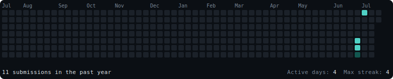

# Hi, I'm Agam 👋

CSE student | Building toward SDE roles | Grinding DSA daily via Striver's A2Z sheet (C++), now also tracking on LeetCode.

## LeetCode Stats

### Submission Heatmap

## GitHub Stats

